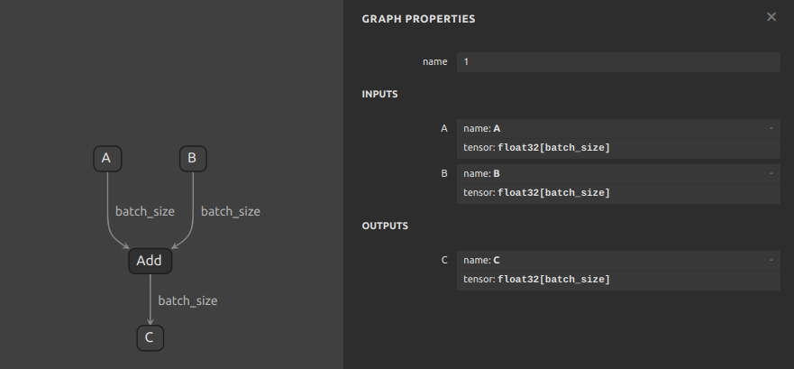

# flutter_onnxruntime_example

## Simple Addition Model

To make a simple demo, we use an addition model with only single operation `Add`. The model takes two inputs and outputs the sum of the two inputs.

### Model overview



### Demo for inferencing with the model:
```dart
import 'package:flutter_onnxruntime/flutter_onnxruntime.dart';

// create inference session
final ort = OnnxRuntime();
final session = await ort.createSessionFromAsset('assets/models/addition_model.onnx');

// get the input and output names
final inputName1 = session.inputNames[0]; // A
final inputName2 = session.inputNames[1]; // B
final outputName = session.outputNames[0]; // C

// specify input with data and shape
final inputs = {
   inputName1: await OrtValue.fromList([1, 1, 1], [3]),
   inputName2: await OrtValue.fromList([2, 2, 2], [3])
}

// start the inference
final outputs = await session.run(inputs);

// print output data
print(await outputs[outputName]!.asList());

// Clean up tensor and resources
for (final tensor in inputs.values) {
    tensor.dispose();
}
for (final tensor in outputs.values) {
    tensor.dispose();
}
await session.close();
```

## More examples
More examples could be found at [flutter_onnxruntime_examples](https://github.com/masicai/flutter-onnxruntime-examples) repo.
